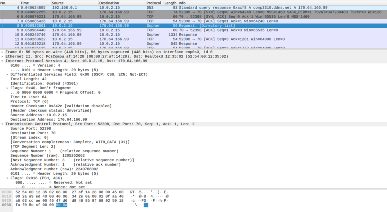

# COMP3310 - Assignment 2: Indexing a Gopher

## Requirements
This Gopher server crawler was implemented in Rust. See the [Installation section](https://doc.rust-lang.org/book/ch01-01-installation.html) of The Rust Programming Language book for installation steps. 

The project also uses the following crates:
* `chrono`: For date-time functionality.
* `debug_print`: For print functions which only trigger in debug mode.

All networking functionality was done using standard library imports.

## Usage
The usage for the program is:
```
gopher [-n <server_name>] [-p <server_port>] [-d]
```
Where
* `-n` specifies the name of the server to crawl
* `-p` specifies the port of the server to crawl 
* `-d` flags that the output directory `out` should not be deleted

with default values `server_name=comp3310.ddns.net` and `server_port=70`.

To run the program in debug mode use
```
cargo run -- [-n <server_name>] [-p <server_port>] [-d]
```
in the root directory. In debug mode, the program will print additional information and error messages. To run the program in release mode use 
```
cargo run --release -- [-n <server_name>] [-p <server_port>] [-d] 
```
This will only print request innformation and the final crawl report. 

## Project Structure
`src`: contains all the program files.
* `main.rs`
* `crawler.rs`
* `gopher.rs`
* `gopher`
    * `request.rs`
    * `response.rs`

`Cargo.toml` and `Cargo.lock`: contains information regarding project dependencies.

`imgs`: contains images used in this `README.md`.

## External Servers
An external server is any referenced server that is on a different host or port to the default server. `comp3310.ddns.net:70` references two external servers. Further details can be found in the crawler report. 

## Invalid References
Files only contribute to the file count and file statistcs if the Gopher transaction was completed sucessfully. Responses that we timed-out are not deemed sucessful transactions. 

As RFC 1436, text file and directory item types should be terminated with the last line `'.'CR-LF`. If the last line is missing, the transaction is not counted as sucessful.

The crawler identified 5 problematic internal references which had to be dealt with explicitly. The full details can be found in the crawler report.

## Wireshark Initial Response
The below image shows the initial Gopher request sent from the crawler to the Gopher server. As shown in the image, the port number is 70.



The below image shows the final Gopher response sent from the Gopher server to the crawler. As shown in the image, the response is terminated with the last line `'.'CR-LF`. The image also shows some of the home-page infomation sent from the Gopher server.


## Crawler Report 
This final crawler report for `comp3310.ddns.net:70` is shown below. 
```
START CRAWLER REPORT

	Number of Gopher directories: 41
		comp3310.ddns.net:70: 
		comp3310.ddns.net:70: /acme
		comp3310.ddns.net:70: /acme/products
		comp3310.ddns.net:70: /acme/products/traps
		comp3310.ddns.net:70: /maze/17
		comp3310.ddns.net:70: /maze/18
		comp3310.ddns.net:70: /maze/19
		comp3310.ddns.net:70: /maze/20
		comp3310.ddns.net:70: /maze/21
		comp3310.ddns.net:70: /maze/22
		comp3310.ddns.net:70: /maze/23
		comp3310.ddns.net:70: /misc
		comp3310.ddns.net:70: /misc/empty
		comp3310.ddns.net:70: /misc/malformed1
		comp3310.ddns.net:70: /misc/more
		comp3310.ddns.net:70: /misc/nesta
		comp3310.ddns.net:70: /misc/nestb
		comp3310.ddns.net:70: /misc/nestc
		comp3310.ddns.net:70: /misc/nestd
		comp3310.ddns.net:70: /misc/neste
		comp3310.ddns.net:70: /misc/nestf
		comp3310.ddns.net:70: /misc/nestg
		comp3310.ddns.net:70: /misc/nesth
		comp3310.ddns.net:70: /misc/nesti
		comp3310.ddns.net:70: /misc/nestj
		comp3310.ddns.net:70: /misc/nestk
		comp3310.ddns.net:70: /misc/nestl
		comp3310.ddns.net:70: /misc/nestm
		comp3310.ddns.net:70: /misc/nestn
		comp3310.ddns.net:70: /misc/nesto
		comp3310.ddns.net:70: /misc/nestp
		comp3310.ddns.net:70: /misc/nestq
		comp3310.ddns.net:70: /misc/nestr
		comp3310.ddns.net:70: /misc/nests
		comp3310.ddns.net:70: /misc/nestt
		comp3310.ddns.net:70: /misc/nestu
		comp3310.ddns.net:70: /misc/nestv
		comp3310.ddns.net:70: /misc/nestw
		comp3310.ddns.net:70: /misc/nestx
		comp3310.ddns.net:70: /misc/nesty
		comp3310.ddns.net:70: /misc/nonexistent

	Number of simple text files: 11
		comp3310.ddns.net:70: /acme/about
		comp3310.ddns.net:70: /acme/contact
		comp3310.ddns.net:70: /acme/products/anvils
		comp3310.ddns.net:70: /acme/products/paint
		comp3310.ddns.net:70: /acme/products/pianos
		comp3310.ddns.net:70: /maze/floppy
		comp3310.ddns.net:70: /maze/statuette
		comp3310.ddns.net:70: /misc/empty.txt
		comp3310.ddns.net:70: /misc/loooooooooooooooooooooooooooooooooooooooooooooooooooooooooooooooooooooooooooooooooooooooooooooooooooooooooooooooooooooooooooooooooooooooooooooooooooooooooooooooooooooooooooooooooooooooooooooooooooooooooooooooooooooooooooooooooooooooooooooooooooooooooooooong
		comp3310.ddns.net:70: /misc/nestz
		comp3310.ddns.net:70: /rfc1436.txt

	Number of binary files: 2
		comp3310.ddns.net:70: /misc/binary
		comp3310.ddns.net:70: /misc/encabulator.jpeg

	Smallest text file: comp3310.ddns.net:70: /misc/empty.txt
		Size: 0 bytes
		Contents: 

	Size of the largest text file: 37393 bytes
		comp3310.ddns.net:70: /rfc1436.txt

	Size of the smallest binary file: 253 bytes
		comp3310.ddns.net:70: /misc/binary

	Size of the largest binary file: 45584 bytes
		comp3310.ddns.net:70: /misc/encabulator.jpeg

	The number of unique invalid references (error types): 2

	List of external servers:
		comp3310.ddns.net:71 did not connect
		gopher.floodgap.com:70 connected successfully

	References that have issues/errors:
		Connection timed out comp3310.ddns.net:70 /misc/godot
		Connection timed out comp3310.ddns.net:70 /misc/tarpit
		File too long comp3310.ddns.net:70 /misc/firehose
		Malformed response line 1Some menu - but on what host???	/misc/malformed1/file	
		Missing end-line comp3310.ddns.net:70 /misc/malformed2

END CRAWLER REPORT
```
